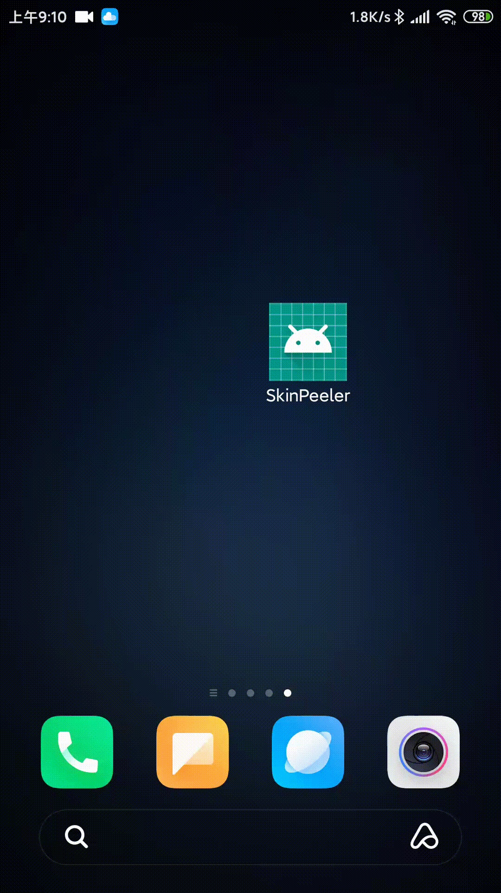

## <center>Android动态换肤
现在的很多应用都有换肤的功能，例如QQ。这类应用都是在线下载皮肤包，然后在不重启的情况下直接完成换肤

### 示例

### 原理
1. Activity setContentView内部调用

关于setContentView的所有方法,这里调用了getWindow()返回了Window，这个Window在activity的attach方法中被赋值为PhoneWindow  
Activity.java源码：
```java

    public void setContentView(@LayoutRes int layoutResID) {
        getWindow().setContentView(layoutResID);
        initWindowDecorActionBar();
    }

    public void setContentView(View view) {
        getWindow().setContentView(view);
        initWindowDecorActionBar();
    }
    
    public void setContentView(View view, ViewGroup.LayoutParams params) {
        getWindow().setContentView(view, params);
        initWindowDecorActionBar();
    }
    
    final void attach(Context context, ActivityThread aThread,
            Instrumentation instr, IBinder token, int ident,
            Application application, Intent intent, ActivityInfo info,
            CharSequence title, Activity parent, String id,
            NonConfigurationInstances lastNonConfigurationInstances,
            Configuration config, String referrer, IVoiceInteractor voiceInteractor,
            Window window, ActivityConfigCallback activityConfigCallback) {
      ...
        mWindow = new PhoneWindow(this, window, activityConfigCallback);
      ...
    }

```

2.  PhoneWindow setContentView内部调用

可以看到实际调用了LayoutInflater.inflate方法  
PhoneWindow.java源码：
```java
 @Override
    public void setContentView(int layoutResID) {
        if (mContentParent == null) {
            installDecor();
        } else if (!hasFeature(FEATURE_CONTENT_TRANSITIONS)) {
            mContentParent.removeAllViews();
        }
        if (hasFeature(FEATURE_CONTENT_TRANSITIONS)) {
            final Scene newScene = Scene.getSceneForLayout(mContentParent, layoutResID,
                    getContext());
            transitionTo(newScene);
        } else {
            mLayoutInflater.inflate(layoutResID, mContentParent);
        }
        mContentParent.requestApplyInsets();
        final Callback cb = getCallback();
        if (cb != null && !isDestroyed()) {
            cb.onContentChanged();
        }
        mContentParentExplicitlySet = true;
    }

    @Override
    public void setContentView(View view) {
        setContentView(view, new ViewGroup.LayoutParams(MATCH_PARENT, MATCH_PARENT));
    }

    @Override
    public void setContentView(View view, ViewGroup.LayoutParams params) {
        // Note: FEATURE_CONTENT_TRANSITIONS may be set in the process of installing the window
        // decor, when theme attributes and the like are crystalized. Do not check the feature
        // before this happens.
        if (mContentParent == null) {
            installDecor();
        } else if (!hasFeature(FEATURE_CONTENT_TRANSITIONS)) {
            mContentParent.removeAllViews();
        }

        if (hasFeature(FEATURE_CONTENT_TRANSITIONS)) {
            view.setLayoutParams(params);
            final Scene newScene = new Scene(mContentParent, view);
            transitionTo(newScene);
        } else {
            mContentParent.addView(view, params);
        }
        mContentParent.requestApplyInsets();
        final Callback cb = getCallback();
        if (cb != null && !isDestroyed()) {
            cb.onContentChanged();
        }
        mContentParentExplicitlySet = true;
    }
```

3. LayoutInflater.inflate内部调用

由源码可知，view由Factory2和Factory创建，如果我们hook了Factory2那不是视图的创建可以由我们说了算
LayoutInflater.java源码：
```java
    public View inflate(@LayoutRes int resource, @Nullable ViewGroup root) {
        return inflate(resource, root, root != null);
    }
    
    public View inflate(@LayoutRes int resource, @Nullable ViewGroup root, boolean attachToRoot) {
        final Resources res = getContext().getResources();
        if (DEBUG) {
            Log.d(TAG, "INFLATING from resource: \"" + res.getResourceName(resource) + "\" ("
                    + Integer.toHexString(resource) + ")");
        }

        final XmlResourceParser parser = res.getLayout(resource);
        try {
            return inflate(parser, root, attachToRoot);
        } finally {
            parser.close();
        }
    }
    
    public View inflate(XmlPullParser parser, @Nullable ViewGroup root, boolean attachToRoot) {
        synchronized (mConstructorArgs) {
            ...
            final View temp = createViewFromTag(root, name, inflaterContext, attrs);
            result = temp;
            return result;
            ...
        }
    }
    
     View createViewFromTag(View parent, String name, Context context, AttributeSet attrs,
            boolean ignoreThemeAttr) {
        ...
            View view;
            if (mFactory2 != null) {
                view = mFactory2.onCreateView(parent, name, context, attrs);
            } else if (mFactory != null) {
                view = mFactory.onCreateView(name, context, attrs);
            } else {
                view = null;
            }
        ...
            return view;
    }
    
    public void setFactory2(Factory2 factory) {
    //由此处可知设置Factory2只能设置一次，所以我们设置时需要将mFactorySet改成false
        if (mFactorySet) {
            throw new IllegalStateException("A factory has already been set on this LayoutInflater");
        }
        if (factory == null) {
            throw new NullPointerException("Given factory can not be null");
        }
        mFactorySet = true;
        if (mFactory == null) {
            mFactory = mFactory2 = factory;
        } else {
            mFactory = mFactory2 = new FactoryMerger(factory, factory, mFactory, mFactory2);
        }
    }
```

4. Factory2

LayoutInflater.java源码：
```java
public interface Factory2 extends Factory {
        public View onCreateView(View parent, String name, Context context, AttributeSet attrs);
    }
```
可以看到参数里面有AttributeSet，我们可以通过AttributeSet筛选需要做处理的属性，记录view和对应的属性，然后在换肤时处理掉就可以达到换肤的目的了，
具体处理逻辑较为复杂，可以通过后面提供的源码查看

### 实现库
